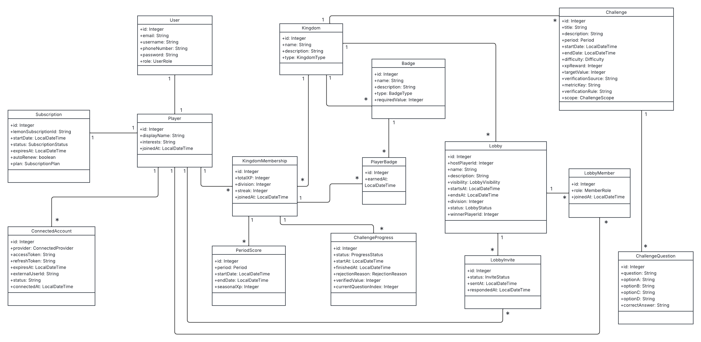
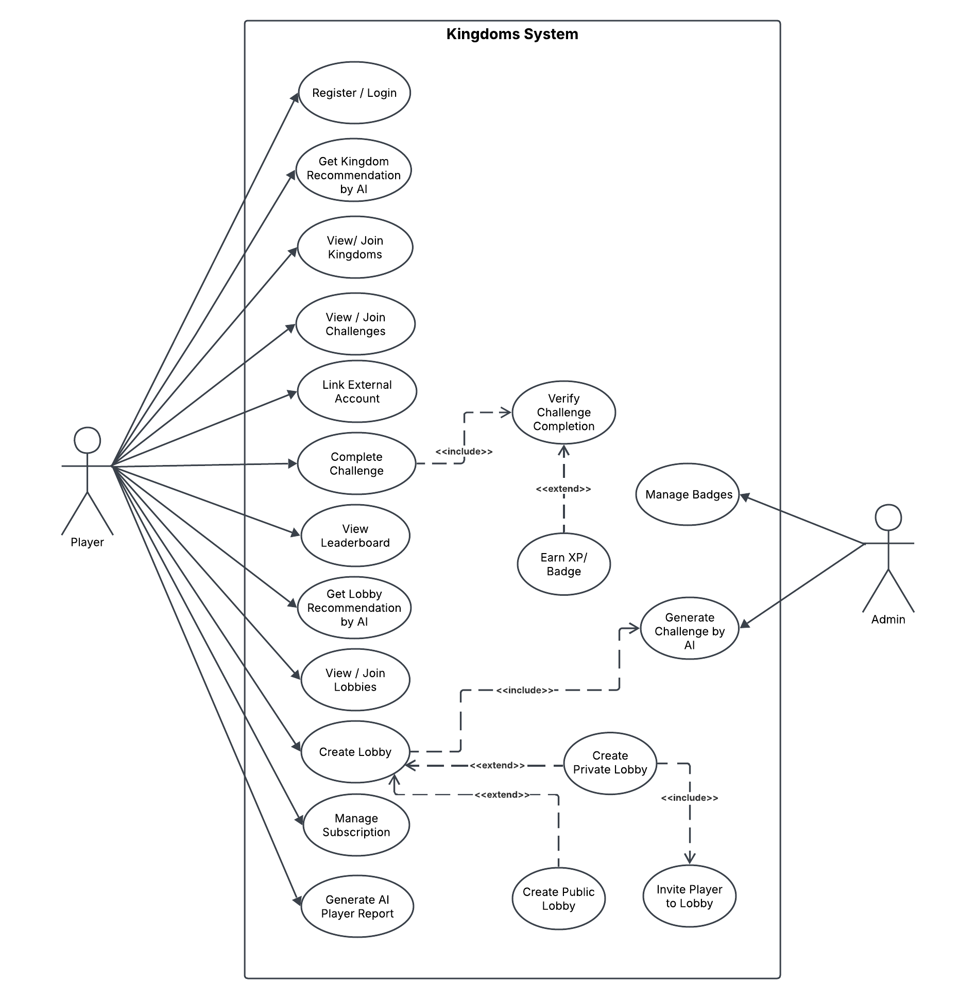

# Shahad — Kingdom (الممالك) Modules

> Kingdoms, memberships, leaderboards, player profiles, earned badges, and AI recommendations for a gamified Arabic-first self-improvement platform.

**🌐 Live API:** http://kingdom-env.eba-qz67sy59.eu-central-1.elasticbeanstalk.com  
**📖 API documentation:** [Postman published docs](https://documenter.getpostman.com/view/52784213/2sBXwwn7pE)  
**🎨 Design:** [Figma](https://www.figma.com/design/QUdd4Fr1vStZdvedZpRfyt/Kingdom?node-id=397-149&t=6DBbB8ELYWQBD5XK-1)

## Overview

**الممالك (Kingdom)** is an Arabic-first, gamified self-improvement platform. A player joins different **kingdoms** (Fitness, Charity, Volunteering, Reading, Gaming, Faith, Knowledge, Nutrition, Programming) and takes on **AI-generated challenges**, then has to **prove** each one through real verification — Strava activities, bank donations over Open Banking (Neotek), volunteer certificates reviewed by AI, WhatsApp quizzes, meal-photo analysis, Steam playtime & achievements, or GitHub contributions. Verified challenges grant **XP** that raises the player's **division** (from D3 up to D1) and earns them **badges**; players also **compete in lobbies** (a Premium subscription via LemonSqueezy unlocks creating them).

**الممالك (Kingdom)** منصّة عربية لتطوير الذات بأسلوب الألعاب. ينضمّ اللاعب إلى **ممالك** متنوّعة (اللياقة، الصدقة، التطوّع، القراءة، الألعاب، الإيمان، المعرفة، التغذية، البرمجة)، ويخوض **تحدّيات يولّدها الذكاء الاصطناعي**، وعليه أن **يُثبت** إكمال كل تحدٍّ عبر تحقّق حقيقي — أنشطة Strava، أو تبرّعات بنكية عبر المصرفية المفتوحة (Neotek)، أو شهادات تطوّع يراجعها الذكاء الاصطناعي، أو اختبارات على واتساب، أو تحليل صور الوجبات، أو وقت اللعب والإنجازات على Steam، أو مساهمات GitHub. التحدّيات المُثبَتة تمنح **نقاط خبرة (XP)** ترفع **درجة اللاعب** (من D3 إلى D1) وتُكسبه **أوسمة**؛ كما **يتنافس اللاعبون في لوبيات** (يفتح اشتراك Premium عبر LemonSqueezy إنشاءها).

## System class diagram

Describes the whole Kingdom system (15 entities), shared across the team; the modules in this README are Shahad's.



## Use case diagram



## My area: Kingdom, KingdomMembership, Badge, PlayerBadge and PeriodScore

This subsystem is where a player **lives inside the kingdoms**. It serves browsing and joining **kingdoms**, the **AI kingdom recommendation** that matches a player's interests to a kingdom, per-kingdom **membership** with all the player's standing — **XP, streak, division, badge, rank, land control, and progress to the next division** — and the **leaderboards** (by period, by division, or both). It also owns the **player profile** and the **AI-written performance report**, the player's **earned badges**, and the **seasonal period-scores**. Finally it owns the **challenge-question quizzes**, including the **WhatsApp quiz** that grades a player's answers by message. Kingdoms owned here: **Reading, Gaming, Faith**.

## AI in Kingdom

Two AI features in this area are player-facing. The **kingdom recommendation** reads a player's stated interests and suggests the kingdom that fits them best. The **AI player report** generates a personalised, plain-Arabic performance summary and emails it to the player. The **Reading, Gaming, and Faith** kingdoms run on **AI-generated challenges** (shared `AiService`, OpenAI gpt-5.5) and are verified through **quizzes** — reading-comprehension questions sourced from **Google Books**, **Faith / Quran** quizzes delivered and graded over **WhatsApp**, and **Steam** playtime/achievement checks for Gaming. XP is always awarded by our own code, never the model.

## My extra endpoints

The endpoints I added on top of the shared CRUD. Base URL `http://localhost:8080` (local) or the live deployment, all under `/api/v1`. Auth is HTTP Basic.

| Method | Path | What it does |
|---|---|---|
| GET | `/kingdom/{kingdomId}/land-control/{division}` | Land-control summary for a division of a kingdom. |
| GET | `/kingdom/{kingdomId}/leaderboard/period/{period}` | Kingdom leaderboard for a period (daily/weekly/monthly). |
| GET | `/kingdom/{kingdomId}/leaderboard/period/{period}/division/{division}` | Leaderboard for a period within one division. |
| GET | `/kingdom/{kingdomId}/leaderboard/division/{division}` | Leaderboard within one division. |
| POST | `/kingdom/ai-recommendation` | AI recommends a kingdom for the player from their interests. |
| GET | `/kingdom-membership/{kingdomId}/member-xp` | The player's XP in a kingdom. |
| GET | `/kingdom-membership/{kingdomId}/member-streak` | The player's current daily streak. |
| GET | `/kingdom-membership/{kingdomId}/member-divison` | The player's division (D3→D1). |
| GET | `/kingdom-membership/{kingdomId}/member-rank` | The player's rank in the kingdom. |
| GET | `/kingdom-membership/{kingdomId}/member-land-percentage` | The player's land-control percentage. |
| GET | `/kingdom-membership/{kingdomId}/xp-need-to-higher-rank` | XP still needed to reach the next rank. |
| GET | `/kingdom-membership/{kingdomId}/number-of-completed-challenges` | Count of the player's completed challenges. |
| GET | `/kingdom-membership/{kingdomId}/division-progress` | Progress toward the next division. |
| POST | `/player/ai-report` | Generate the player's AI report (PDF) and email it. |
| GET | `/player/summary` | The player's cross-kingdom summary. |
| GET | `/player/best-kingdom` | The player's strongest kingdom. |
| GET | `/player/kingdoms` | The kingdoms the player belongs to. |
| GET | `/player/highest-streak` | The player's highest streak across kingdoms. |
| GET | `/player-badge/player-badges` | All badges the player has earned. |
| GET | `/player-badge/{kingdomId}/member-badges` | Badges the player earned in one kingdom. |
| GET | `/subscription/days-left` | Days remaining on the player's premium subscription. |
| GET | `/lobby/{lobbyId}/member-count` | Number of members in a lobby. |
| GET | `/lobby/my-finished` | The player's finished lobbies. |

## Tech stack

Java 17 · Spring Boot 4.0.6 · Spring Web · Spring Data JPA (Hibernate) · MySQL · Lombok · Maven · OpenAI (gpt-5.5) · Steam · Google Books · Twilio (WhatsApp) · Mailtrap.

## Run it

```bash
# MySQL on localhost with a database named `Data`, then:
mvn spring-boot:run
```

- Local base URL: `http://localhost:8080/api/v1`
- Live deployment: `http://kingdom-env.eba-qz67sy59.eu-central-1.elasticbeanstalk.com/api/v1`
- API documentation (Postman): https://documenter.getpostman.com/view/52784213/2sBXwwn7pE
- Provide secrets as env vars (or a git-ignored `src/main/resources/application-local.properties`): `OPENAI_API_KEY`, `TWILIO_ACCOUNT_SID`/`TWILIO_AUTH_TOKEN`, `MAILTRAP_API_TOKEN`, `STEAM_*`, `GOOGLE_BOOKS_*`.
- For deployment set `SPRING_JPA_HIBERNATE_DDL_AUTO=update` and `DEMO_SEED_ENABLED=false`.

## Team

This project — built by  **Shahad**, **Anas**, and **Maysun**. The modules documented in this README belong to **Shahad** (kingdoms, membership, leaderboards, profile, badges, challenge-question quizzes — Reading / Gaming / Faith).
