# Kingdom (مملكة) — Master Project Specification

> Single source of truth for the graduation project. Covers the idea, requirements, domain model & relations, use cases, pages, the Spring Boot + MySQL backend, and the external APIs used to verify each kingdom. Arabic‑first (RTL) product; demo kingdom = **Sports (الرياضة)**, the other kingdoms are roadmap (mocked + clearly labelled).

---

## 1. The Idea — what we're building
Kingdom is a competitive, gamified **self‑improvement platform**. Players earn XP **only from real, verified activity** — never self‑report; the anti‑cheat is the core selling point. You join "kingdoms" (life domains), rank up **per kingdom**, capture **territory on a hex map**, and compete in **AI‑refereed, division‑based leagues**. One‑line pitch: **«عشرُ ممالك، عشرةُ عروش — تقدّمٌ يُكتسب، لا يُدّعى.»** (Ten kingdoms, ten thrones — progress earned, not claimed.)

**Why it's different:** every point is backed by a connected data source (fitness app, GitHub, donation receipt, Quran recitation, etc.) or by an AI judge — so leaderboards and "kings" are real.

---

## 2. Goals & Scope
- **Demo scope:** fully build the **Sports** kingdom end‑to‑end; the other 9 kingdoms are modelled but their verification is mocked/labelled "roadmap".
- **Audience:** Saudi users, Arabic‑first UI, RTL.
- **Cost target:** the whole stack runs at ≈ **$0** for the demo (only Claude costs cents; gateway fees apply only on real sales).
- **Platforms:** responsive web app (React) + Spring Boot API.

---

## 3. Requirements

### 3.1 Functional
- Sign up / sign in / verify account; manage profile & a unique map **colour**.
- AI recommends kingdoms from a player's stated interests.
- Join kingdoms (free: up to 2; Premium: 3+), with a per‑kingdom **XP, level, and derived division**.
- Browse & **join** challenges (must join to start), auto‑track progress, **verify** (API or AI), then **claim XP**.
- View a kingdom's **hex territory map** (all‑time and current‑season views) and **division‑scoped leaderboards**.
- Earn **badges** (level‑up, seasonal, king, milestone).
- **Lobbies** (Premium): create public/private competitions, set a start time, invite by phone (WhatsApp), compete live, see results.
- **Special Events** (Kingdom 10) + **Admin** seasonal events.
- Manage **Premium subscription** & billing.

### 3.2 Non‑functional
- **Anti‑cheat / idempotency:** a verified action is recorded once via `UNIQUE(source, externalId)`; retried webhooks never double‑count.
- **Security:** Clerk‑issued JWT verified on every request; no API keys in the browser; webhooks signature‑verified.
- **Realtime:** live leaderboard & lobby updates (Ably).
- **Arabic/RTL**, accessible, mobile‑friendly, fast (Redis caching).

---

## 4. The 10 Kingdoms & how each is verified
| # | Kingdom | Arabic | Primary verification source |
|---|---------|--------|------------------------------|
| 1 | **Sports** (demo) | الرياضة | Apple Health / Google Fit |
| 2 | Learning & Skills | التعلّم والمهارات | GitHub (+ AI quiz) |
| 3 | Charity | الصدقة | Moyasar / Ehsan donation webhook |
| 4 | Gaming | الألعاب | Steam (+ Twitch) |
| 5 | Volunteering | التطوّع | QR / geofence check‑in (Geoapify) |
| 6 | Faith | الإيمان | Quran Foundation API + Deepgram (recitation) |
| 7 | Nutrition | التغذية | Open Food Facts |
| 8 | Reading | القراءة | Google Books + Readwise |
| 9 | Creator & Arts | الإبداع | YouTube / Behance |
| 10 | **Special Events** | الفعاليات | No fixed source — the **AI** sets the category, rules & scoring |

---

## 5. Core Gameplay & Rules (the invariants the system must enforce)

### 5.1 XP, levels & divisions
- **XP is per kingdom**, stored on `KingdomMembership.xp` (a player can be D1 in Sports and D3 in Reading at once).
- **Division is derived from XP, never stored:** **D1 = 25,000+ · D2 = 10,000–24,999 · D3 = 0–9,999.**
- The AI serves challenges matched to your division; difficulty = easy/medium/hard is **relative to division** (easy in D1 ≈ hard in D3). *Division is auto‑detected from XP; it is never chosen.*

### 5.2 Challenge lifecycle (join → finish → verify → award / reject)
1. **Join** — opening a challenge and tapping Join creates a `ChallengeProgress` (`status = JOINED`); nothing is tracked before joining. A player may have **many** challenges active.
2. **Progress** — connected APIs (or proof) feed `ActivityRecord`s (`IN_PROGRESS`).
3. **Submit** — when the target looks met (`SUBMITTED`).
4. **Verify — by API or by AI:** API‑verifiable kingdoms use the connected API; non‑API/custom challenges are judged by the **AI Service**.
5. **Outcome:**
   - ✅ **Approved** (`VERIFIED`) → award `xpReward` to **`KingdomMembership.xp`** (all‑time) **and** the active **`PeriodScore.xp`** (leaderboard). May earn a badge.
   - ❌ **Rejected** → no XP, with a reason. **Failing never subtracts XP** — you just don't gain.

**Rejection design:** `NOT_COMPLETED` → retry while the window is open · `UNVERIFIABLE` → auto re‑sync, else expire · `FLAGGED` (impossible/cheating) → no retry, sent to **Admin anti‑cheat review**.

### 5.3 Hex territory map (two views)
Each player has a **unique colour** (`Player.colorHex`). On a kingdom's hex grid a player **owns 1 tile per 100 points**, coloured by their colour — most points = biggest territory; the tile‑leader gets the crown.
- **All‑time map** — from `KingdomMembership.xp` (persistent; stored on `HexTile.ownerMembershipId`).
- **Season / current map** — from the active `PeriodScore.xp` (resets each period; computed live).
Regions are contiguous (one solid territory per player), sized to exact share.

### 5.4 Leaderboards & royalty
- Leaderboards are **division‑scoped** — you only rank against your own tier. Periods: **daily · weekly · monthly**.
- The **#1 of D1** each period becomes that kingdom's **King/Queen (ملك/ملكة)** and gets a royal badge → **ten thrones**, one per kingdom.

### 5.5 Badges
Earned on **level‑up**, **seasonal/special** completion, **king** (period win), or **milestone** (cumulative). Optional — not on every XP gain.

---

## 6. Lobbies & Competitions
- Lobbies live **outside** the kingdoms. **Creating any lobby (public or private) requires Premium.** A lobby **creates its own `Challenge` row** (`scope = LOBBY`).
- **Create flow:** choose **difficulty** (easy/med/hard) → **visibility** (public/private) → **set the challenge** one of three ways → **set a start time**.
  - **Public:** pick a listed challenge, **or** generate with AI.
  - **Private:** pick listed, **or** write a **custom** challenge → the AI structures it into a measurable goal (distance / time / finish‑at).
- **Start time:** the host picks date+time; the competition **auto‑starts** at that time and **cannot be started manually**. The host **cannot cancel** the lobby if the start is **less than 8 hours** away.
- **Browse:** the lobby list shows **public lobbies only** (private are invite‑only via WhatsApp). Each row shows difficulty, start‑in time, and challenge type. Players **open the room (preview) first, then join from inside**.
- **Invites (private):** by phone → WhatsApp → accept/decline → join.
- **Matching & XP:** public lobbies match by division; private ignore it. **Public win → profile XP only (NOT leaderboard); private → no XP** (friendly).

---

## 7. Special Events (Kingdom 10) & Admin
- Kingdom 10 is an **open** kingdom for any category outside the 9, with **no preset challenges**.
- **Premium flow:** create a lobby there → **describe a custom category** → the **AI generates** a challenge → **approve or regenerate** until satisfied.
- **Admin role** (`User.role = ADMIN`): create **public seasonal events** inside normal kingdoms (e.g. a Ramadan challenge in Faith) that anyone can join; can grant seasonal badges.
- Events **reuse the `Lobby` entity** (no separate Event entity): `Lobby.kind` ∈ {NORMAL, SPECIAL_EVENT, SEASONAL}, `createdByAdmin`, `kingdomId`, free‑text `category`.

---

## 8. Subscription / Monetization
- **Free:** join up to 2 kingdoms; everything basic.
- **Premium — 29 SAR/mo:** 3rd+ kingdom, Kingdom 10 (Special Events), and creating lobbies.
- Billing via a **Merchant of Record (Lemon Squeezy)** → **no `Payment` table**; a slim `Subscription` mirrors status via webhook (`providerRef` for reconciliation). **Moyasar** is the Saudi/mada alternative + the Charity donation‑verification webhook.

---

## 9. Domain Model (Class Diagram)

### 9.1 Class diagram (Mermaid)

```mermaid
classDiagram
  class User { Integer id; String email; String username; String phoneNumber; boolean isVerified; UserRole role; LocalDateTime createdAt }
  class Subscription { Integer id; SubscriptionPlan plan; SubscriptionStatus status; String providerRef; LocalDateTime expiresAt; boolean autoRenew }
  class Player { Integer id; String displayName; String avatarUrl; String interests; String colorHex; String language; boolean notifyEmail; boolean notifyPush; boolean publicProfile; LocalDateTime joinedAt }
  class Kingdom { Integer id; String name; String nameAr; KingdomType type; boolean premiumOnly; String verificationSource }
  class KingdomMembership { Integer id; Integer playerId; Integer kingdomId; long xp; int level; boolean active; LocalDateTime joinedAt; division() }
  class ActivityRecord { Integer id; String source; String externalId; String rawValue; long xpAwarded; VerificationStatus status; LocalDateTime verifiedAt }
  class PeriodScore { Integer id; Period period; LocalDateTime periodStart; LocalDateTime periodEnd; long xp }
  class Challenge { Integer id; Integer kingdomId; String title; String description; ChallengeScope scope; Period period; Difficulty difficulty; String category; long xpReward; boolean aiGenerated; String verificationSource }
  class ChallengeProgress { Integer id; Integer membershipId; int progress; ProgressStatus status; LocalDateTime joinedAt; LocalDateTime submittedAt; LocalDateTime verifiedAt; int attempts; RejectionReason rejectionReason; VerifierType verifiedBy; long xpEarned }
  class Badge { Integer id; String name; BadgeType type; String ruleKey; Integer challengeId; String iconUrl }
  class PlayerBadge { Integer id; Integer badgeId; Integer kingdomId; LocalDateTime earnedAt }
  class HexTile { Integer id; Integer kingdomId; int q; int r; Integer ownerMembershipId; LocalDateTime capturedAt }
  class Lobby { Integer id; Integer hostPlayerId; LobbyKind kind; boolean createdByAdmin; Integer kingdomId; String category; Difficulty difficulty; LobbyVisibility visibility; Integer challengeId; LobbyStatus status; String inviteCode; LocalDateTime startsAt; LocalDateTime endsAt }
  class LobbyMember { Integer id; Integer lobbyId; Integer playerId; MemberRole role; long score; LocalDateTime joinedAt }
  class LobbyInvite { Integer id; Integer lobbyId; String phone; Integer invitedPlayerId; InviteChannel channel; InviteStatus status; LocalDateTime sentAt; LocalDateTime respondedAt }
  class ConnectedAccount { Integer id; Integer playerId; ConnectedProvider provider; String accessToken; String refreshToken; LocalDateTime expiresAt; String externalUserId; String status; LocalDateTime connectedAt }
  class Notification { Integer id; Integer playerId; NotificationType type; String title; String body; boolean read; String linkRef; LocalDateTime createdAt }
  class Post { Integer id; String title; String slug; String body; String coverUrl; Integer authorId; LocalDateTime publishedAt }

  User "1" --> "1" Player : has
  User "1" --> "*" Subscription : pays
  Player "1" --> "*" KingdomMembership : joins
  Player "1" --> "*" PlayerBadge : earns
  Player "1" --> "*" ConnectedAccount : links
  Player "1" --> "*" Notification : receives
  Player "1" --> "*" Lobby : hosts
  Kingdom "1" --> "*" KingdomMembership : has
  Kingdom "1" --> "*" Challenge : offers
  Kingdom "1" --> "*" HexTile : grid
  Kingdom "1" --> "*" Lobby : category
  KingdomMembership "1" --> "*" ActivityRecord : logs
  KingdomMembership "1" --> "*" PeriodScore : scores
  KingdomMembership "1" --> "*" ChallengeProgress : progresses
  KingdomMembership "1" --> "*" HexTile : owns
  Challenge "1" --> "*" ChallengeProgress : tracked by
  Challenge "0..1" --> "1" Lobby : created by
  Badge "1" --> "*" PlayerBadge : awarded as
  Lobby "1" --> "*" LobbyMember : has
  Lobby "1" --> "*" LobbyInvite : sends
```

### 9.2 Entities & key fields (≈18)
> IDs are `Integer` (`@GeneratedValue(IDENTITY)`); timestamps `LocalDateTime`; fixed sets are enums; `division()` and tile counts are **derived getters** (never stored). ⭐ = the bridge.

| # | Entity | Key fields | Relationships |
|---|--------|-----------|---------------|
| 1 | **User** | email, username, phoneNumber, isVerified, role (USER/ADMIN), createdAt | 1–1 Player · 1–* Subscription |
| 2 | **Subscription** | plan, status, providerRef, expiresAt, autoRenew | belongs to User |
| 3 | **Player** | displayName, avatarUrl, interests, **colorHex**, language, notifyEmail, notifyPush, publicProfile, joinedAt | 1–* KingdomMembership · PlayerBadge · ConnectedAccount · Notification · Lobby(host) |
| 4 | **Kingdom** | name, nameAr, type, premiumOnly, verificationSource | 1–* Challenge · HexTile · KingdomMembership · Lobby |
| 5 | **KingdomMembership** ⭐ | playerId, kingdomId, xp, level, `division()`, active, joinedAt · UNIQUE(playerId,kingdomId) | bridge Player↔Kingdom · 1–* ActivityRecord · PeriodScore · ChallengeProgress |
| 6 | **ActivityRecord** | source, externalId, rawValue, xpAwarded, status, verifiedAt · **UNIQUE(source,externalId)** | belongs to KingdomMembership |
| 7 | **PeriodScore** | period, periodStart, periodEnd, xp | belongs to KingdomMembership (leaderboard bucket; rank computed) |
| 8 | **Challenge** | kingdomId, title, description, scope (SOLO/LOBBY), period, difficulty, category, xpReward, aiGenerated, verificationSource | 1–* ChallengeProgress |
| 9 | **ChallengeProgress** | membershipId, progress, status, joinedAt, submittedAt, verifiedAt, attempts, rejectionReason, verifiedBy, xpEarned | belongs to Challenge · refs ActivityRecord(s) |
| 10 | **Badge** | name, type, ruleKey, challengeId (nullable), iconUrl | catalog |
| 11 | **PlayerBadge** | badgeId, kingdomId (nullable), earnedAt | belongs to Player → Badge |
| 12 | **HexTile** | kingdomId, q, r, ownerMembershipId (nullable, all‑time owner), capturedAt | belongs to Kingdom (shared grid) |
| 13 | **Lobby** | hostPlayerId, kind (NORMAL/SPECIAL_EVENT/SEASONAL), createdByAdmin, kingdomId, category, difficulty, visibility, challengeId, status, inviteCode, startsAt, endsAt | 1–* LobbyMember · LobbyInvite |
| 14 | **LobbyMember** | lobbyId, playerId, role, score, joinedAt | belongs to Lobby |
| 15 | **LobbyInvite** | lobbyId, phone, invitedPlayerId (nullable), channel, status, sentAt, respondedAt | belongs to Lobby |
| 16 | **ConnectedAccount** | playerId, provider, accessToken, refreshToken, expiresAt, externalUserId, status, connectedAt · UNIQUE(playerId,provider) | belongs to Player (OAuth tokens for auto‑verify) |
| 17 | **Notification** | playerId, type, title, body, read, linkRef, createdAt | belongs to Player |
| 18 | **Post** *(optional — blog)* | title, slug, body, coverUrl, authorId, publishedAt | catalog |

### 9.3 Relationships explained
- **User ↔ Player (1–1):** `User` = the account (auth, email, role); `Player` = the game profile (no global level/XP — progression is per kingdom).
- **KingdomMembership** is the **association/bridge** between Player and Kingdom; it holds the per‑kingdom `xp`/`level` and the **derived** `division()`. It enforces the 2‑free‑kingdoms rule and is the parent of `ActivityRecord`, `PeriodScore`, and `ChallengeProgress`.
- **ActivityRecord** is the verified evidence; **ChallengeProgress** is the per‑challenge state machine that awards XP on `VERIFIED`.
- **HexTile** belongs to a Kingdom (shared/contested grid); `ownerMembershipId` is the current all‑time owner; the season map is computed from `PeriodScore`.
- **Lobby** reuses one entity for normal/special/seasonal via `kind`; it owns its own `Challenge` (`scope = LOBBY`), its `LobbyMember`s, and `LobbyInvite`s.
- **Badge ↔ Challenge:** `Badge.challengeId` is set only for SEASONAL badges (kept as a nullable attribute, not a drawn relation, to keep the diagram a clean tree).

### 9.4 Enums
`SubscriptionPlan` · `SubscriptionStatus` · `KingdomType` (the 10) · `Period` {DAILY, WEEKLY, MONTHLY, YEARLY} · `Difficulty` {EASY, MEDIUM, HARD} · `ChallengeScope` {SOLO, LOBBY} · `VerificationStatus` {PENDING, VERIFIED, REJECTED} · `BadgeType` {LEVEL, SEASONAL, KING, MILESTONE} · `LobbyVisibility` {PUBLIC, PRIVATE} · `LobbyStatus` {OPEN, ACTIVE, FINISHED, CANCELLED} · `MemberRole` {HOST, MEMBER} · `InviteChannel` {WHATSAPP, EMAIL} · `InviteStatus` {PENDING, ACCEPTED, REJECTED} · `UserRole` {USER, ADMIN} · `LobbyKind` {NORMAL, SPECIAL_EVENT, SEASONAL} · `ProgressStatus` {JOINED, IN_PROGRESS, SUBMITTED, VERIFIED, REJECTED, EXPIRED} · `RejectionReason` {NOT_COMPLETED, UNVERIFIABLE, FLAGGED} · `VerifierType` {API, AI, ADMIN} · `ConnectedProvider` {STRAVA, GITHUB, GOOGLE_FIT, APPLE_HEALTH, STEAM, …} · `NotificationType` {INVITE, RESULT, LEVEL_UP, BADGE, SYSTEM}

---

## 10. Use Cases (5 flows)
> Classic UML use‑case diagrams (visual file: `kingdom-usecases.html`). Actors: **Player**, **Premium Player** (generalizes Player), **Invited Player**, **Admin**, **Payment Gateway**.

**1 · Account & Subscription** — Sign in · Manage profile · Subscribe to Premium *(«include» Process payment)* · Manage billing (renew/cancel/history).

**2 · Onboarding — Join a Kingdom** — View kingdoms · Enter interests *(«include» AI recommends kingdoms)* · Join a kingdom (free: up to 2) *(«include» Get division by XP)*.

**3 · Gameplay — Challenges & XP** — View challenges (by division tier) · **Choose challenge** · Complete challenge *(«include» Verify activity, «include» Earn XP)* · Earn XP *(«include» Update leaderboard, «extend» Earn badge)* · View leaderboards (daily/weekly/monthly).

**4 · Create a Lobby (Premium)** — Create lobby (public/private) with three challenge sources as «extend»: **Pick a listed challenge**, **Generate AI challenge** (uses division), **Write a custom challenge** (private only) — the latter two «include» **AI structures challenge** (distance/time/target). Then set start time.

**5 · Join & Compete** — Invite by phone (private) → Join a lobby → Compete in challenge *(«include» Earn score)* → Show results. *(Public → profile XP only; private → no XP.)*

---

## 11. Pages / Screens
> ~72 screens across 9 areas. Status: ✅ backed by the model · ⚠️ needs an addition · 📄 static content. Full sheet: `kingdom-pages.md`.

- **A · Public/Marketing:** Landing, About, How It Works, The 10 Kingdoms, Features, Pricing, FAQ, Contact, Blog list/post (⚠️ `Post`), Privacy, Terms, 404.
- **B · Auth & Onboarding:** Sign Up, Sign In, Forgot/Reset Password, Verify (OTP), Onboarding (Welcome → Interests → AI Recommendations → Choose Kingdoms → Pick Colour ⚠️), Premium Paywall.
- **C · Kingdoms & Hex Map:** Kingdoms Home (10 + AI suggestion), Kingdom Hub, Hex Map **all‑time** & **season** ⚠️colorHex, Tile/Player detail, Members, My Standing.
- **D · Challenges:** Feed (by division), Detail, **Join** ⚠️, My Active ⚠️, Tracking, Submit ⚠️, Verification Pending/Approved/Rejected ⚠️, Claim XP, History ⚠️, Connect Sources ⚠️`ConnectedAccount`.
- **E · Leaderboards & Honors:** Kingdom Leaderboard (division‑scoped), Season Winners / Hall of Kings, Badges, Badge Detail.
- **F · Lobbies & Battles:** Lobbies Home (public only), Create Lobby (difficulty → visibility → challenge → time), Lobby Room (preview → join), Invite, Live Competition, Results.
- **G · Special Events:** Special Events Home, Create Special Event, Seasonal Events (admin).
- **H · Profile & Account:** My Profile, Public Profile, Edit Profile ⚠️colorHex, Settings ⚠️prefs, Notifications ⚠️`Notification`, Connected Accounts ⚠️, Subscription & Billing. *(Implemented no‑scroll profile: `kingdom-profile.html` — info / subscription / badges / statistics, statistics split into all‑kingdoms & fitness pages.)*
- **I · Admin:** Admin Dashboard, Seasonal Events, Users, Kingdoms/Challenges, Flagged Verifications (anti‑cheat).

**Additions needed to cover every ⚠️ page:** `Player.colorHex` + preference fields · `ChallengeProgress` state machine · new entities `ConnectedAccount`, `Notification`, and (optional) `Post`. ~50 pages are buildable on the current model as‑is.

---

## 12. Backend System (Spring Boot + MySQL)
> Mirrors the local `Security` reference project. **Spring Boot 4.0.6** (Jackson 3 = `tools.jackson`), Java 21+, **MySQL** + **Redis**.

**Layered packages:** `model` · `repository` · `service` · `controller` · `client` (one outbound adapter per external API) · `config` · `advice` (global `@RestControllerAdvice`) · `dto`.

**Conventions:** `Integer` IDs (`@GeneratedValue IDENTITY`), `LocalDateTime`, enums, derived getters; DTOs for all I/O with Bean Validation; tests use `@MockitoBean` (`@MockBean` removed in Boot 4).

**Five integration patterns:**
1. **Adapter / Strategy** — a `VerificationProvider` interface with one implementation per kingdom/source in `client`.
2. **Signature‑verified, idempotent webhooks** — billing (Lemon Squeezy/Moyasar), donations, activity; dedup via `UNIQUE(source, externalId)`.
3. **OAuth connect** — `ConnectedAccount` stores per‑provider tokens so the backend can pull activity on the player's behalf.
4. **AI in the service layer** — Claude recommends kingdoms, generates/structures challenges, judges AI‑verified submissions, sets event rules (not an entity).
5. **Realtime + scheduling** — Ably pushes live updates; Redis caches leaderboards; schedulers roll period scores and crown kings.

**XP/award flow (service layer):** join → ActivityRecord(s) → submit → verify (API/AI) → on VERIFIED add `xpReward` to `membership.xp` **and** the active `PeriodScore`; recompute division & tiles; maybe award a badge.

**Auth:** Clerk issues the token; the backend verifies the Clerk JWT each request and resolves the `User`/`Player` (no passwords stored).

**Deployment:** Backend + MySQL + Redis on **Render**; React on **Vercel**; secrets via env vars only.

---

## 13. External APIs (the full list)
> The Spring Boot backend is the only caller; the browser never sees a key. Whole stack ≈ **$0** for the demo. (Reference PDF: `Kingdom-API-Reference.pdf`.)

### Platform & core services
| # | API | Role | Pricing |
|---|-----|------|---------|
| 1 | **Clerk** | Identity & auth (User account, sessions, social login) | Free ≤ 50,000 MAU |
| 2 | **Anthropic Claude** | The "AI Service" — recommend kingdoms, generate/structure challenges, judge AI verification, Arabic coach | Pay‑as‑you‑go (Sonnet 4.6 $3/$15, Opus 4.8 $5/$25, Haiku 4.5 $1/$5 per MTok) |
| 3 | **Lemon Squeezy** | Payments — Merchant of Record (sells Premium; webhook updates Subscription) | 5% + $0.50 / sale, no monthly |
| 4 | **Moyasar** | Saudi payment gateway (mada/cards) + Charity donation webhook | mada 1.75% + 1 SAR · cards 2.2% + 1 SAR |
| 5 | **Ably** | Realtime — live leaderboard & lobby/battle updates | Free tier |
| 6 | **Twilio (WhatsApp)** | Private‑lobby invites by phone | Sandbox free · ~$0.005/msg + Meta rates |
| 7 | **Resend** | Transactional email (receipts, renewals, account) | Free 3,000/mo |
| 8 | **Cloudinary** | Media (avatars, proof photos, badge icons) | Free 25 credits/mo |
| 9 | **Cloudflare Turnstile** | Bot check on sign‑up / sensitive actions (anti‑cheat) | Free |
| 10 | **OpenAI Moderation** | Screen user‑written custom challenge text before the AI structures it | Free |

### Verification APIs (the anti‑cheat core — per kingdom)
| # | API | Kingdom | Pricing |
|---|-----|---------|---------|
| 11 | **Apple HealthKit / Google Fit** | Sports (demo) — workout → verified ActivityRecord | Free |
| 12 | **Strava** | Sports (optional, richer) | $11.99/mo since Jun 2026 → **skipped for the free demo** |
| 13 | **GitHub** | Learning & Skills (commits/contributions; webhooks) | Free |
| 14 | **Steam Web API (+ Twitch)** | Gaming (achievements, playtime) | Free |
| 15 | **Quran Foundation API + Deepgram** | Faith (recitation transcribed & matched) | Deepgram $200 free credit |
| 16 | **Open Food Facts (+ USDA/Edamam)** | Nutrition (barcode/photo meal log) | Free |
| 17 | **Google Books + Readwise** | Reading (finished books & highlights) | Free |
| 18 | **YouTube Data / Behance** | Creator & Arts (published work) | Free quota |
| 19 | **Geoapify (or Foursquare)** | Volunteering (geofence/QR check‑in) | Free 3,000/day |

**Notes:** Kingdom 10 (Special Events) has no dedicated API — the AI Service decides category, rules & scoring. Government/Ehsan/Nafath have no student‑obtainable API yet → mocked + labelled "roadmap". Anti‑cheat backbone: every verified action is stored once via `UNIQUE(source, externalId)`.

---

## 14. Tech Stack & Deployment (summary)
- **Backend:** Spring Boot 4.0.6, Java 21, Maven, MySQL, Redis.
- **Frontend:** React (Vite), RTL/Arabic, light + dark themes; fonts Cairo/El Messiri/Tajawal (Arabic), Playfair (wordmark), JetBrains Mono (numbers); Phosphor icons; D3 + topojson for maps.
- **Auth:** Clerk · **AI:** Claude · **Payments:** Lemon Squeezy (+ Moyasar) · **Realtime:** Ably · **Email:** Resend · **WhatsApp:** Twilio · **Media:** Cloudinary.
- **Deploy:** Render (API + MySQL + Redis) · Vercel (web).

---

## 15. Open / pending items
- **TileCapture** history (conquest timeline) — keep or drop? *(all‑time owner already lives on `HexTile`; this is only for a history log.)*
- **Blog** — keep (adds `Post`) or cut for the demo?
- Confirm any final field tweaks before generating the JPA entities.

---

### Companion files in this project
- `kingdom-system-understanding.md` — the working spec (source for §5–§9).
- `kingdom-usecases.html` — the 5 UML use‑case diagrams.
- `kingdom-pages.md` — the full 72‑page work‑split sheet.
- `Kingdom-API-Reference.pdf` — the API reference (§13).
- `kingdom-backend-architecture.html` — the layered backend diagram (§12).
- `kingdom-ai-class-v3.html` — the visual class diagram (§9).
- `kingdom-sport.html`, `kingdom-app-dark.html` / `kingdom-app-white.html`, `kingdom-landing*.html`, `kingdom-profile.html` — the UI screens.
- `kingdom-backend-agent.md`, `kingdom-fullstack-agent.md` — briefs for building the system with other agents.
